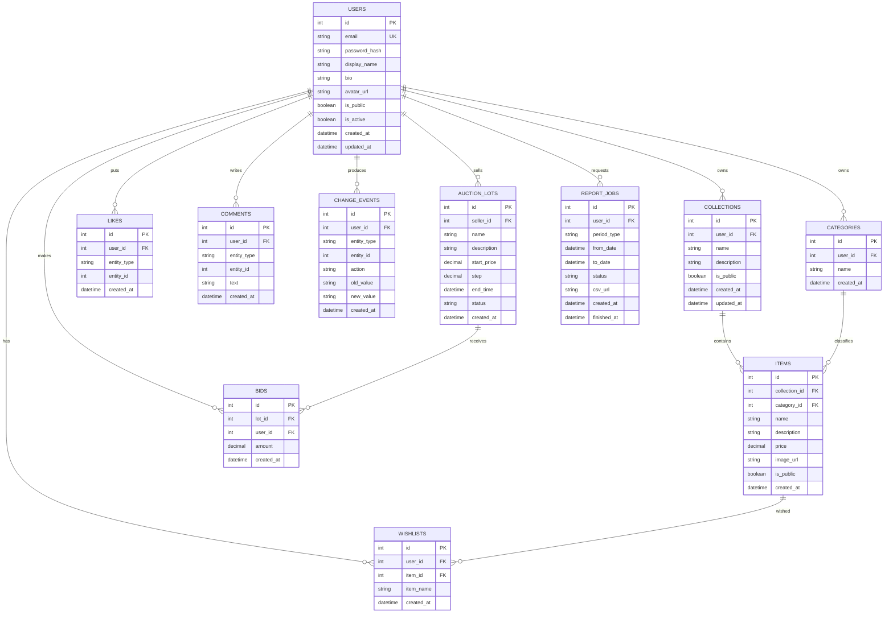

# CollectiblesVault: Gap-анализ, endpoint-ы и ERD

> Текущий API в приложении регистрируется с префиксом `API_PREFIX` (по умолчанию `/api`), поэтому фактические пути: `/api/...`.

## 1) Матрица соответствия ТЗ

| Блок ТЗ | Статус | Что есть сейчас | Чего не хватает |
|---|---|---|---|
| Регистрация/вход | Частично/OK | `POST /api/register`, `POST /api/login` | Нет refresh token/logout |
| Просмотр своего профиля | OK | `GET /api/auth/me` | Нет расширенных полей профиля |
| Изменение данных профиля | Нет | - | Нужны endpoint и SQL update для `users` |
| Свои коллекции и редактирование | OK | CRUD: `/api/collections` | Нет публичности (`is_public`) |
| Свои предметы и редактирование | OK | CRUD: `/api/items` | Нет отдельной публичности/модерации |
| Просмотр других пользователей | Нет | - | Нужны `/api/users`, `/api/users/{id}` |
| Просмотр чужих коллекций | Нет | - | Нужны публичные endpoint-ы |
| Лайк/коммент/добавить в желаемое | Частично/OK | `POST /api/like`, `POST /api/comment`, `/api/wishlist` | Нет строгой модели доступа к чужим данным |
| Просмотр wishlist | OK | `GET /api/wishlist` | Нет фильтров/пагинации |
| Отчеты за период | Частично | `GET /api/reports/*` | Нет week/month/year как отдельного формата |
| CSV отчеты | Нет | - | Нужны CSV endpoint-ы |
| "Меню" интерфейса | Вне backend | Backend API есть | Реализуется во frontend |

## 1.1) Перепроверка с учетом нового правила (варианты 4.1 / 4.2)

| Вариант правила | Суть правила | Что нужно в БД | Что нужно в API | Статус в текущем коде |
|---|---|---|---|---|
| `4.1` Отключение профиля | Пользователь может выключить профиль целиком; при выключении его контент не виден другим | `users.is_active BOOLEAN`, опц. `deactivated_at` | `PATCH /api/auth/me/deactivate`, фильтрация `is_active=true` в публичных списках | Не реализовано |
| `4.2` Публичность контента | Пользователь сам выбирает, какие коллекции/предметы видны другим | `collections.is_public`, опц. `items.is_public` | `PATCH /api/collections/{id}/visibility`, `GET /api/users/{id}/collections` (только public), `GET /api/collections/{id}/items` | Не реализовано |
| Комбинированный (рекомендуется) | Есть и глобальное отключение профиля, и точечная публичность контента | Оба набора полей | Оба набора endpoint-ов | Не реализовано |

| Рекомендация | Значение |
|---|---|
| Режим для продакшна | Использовать комбинированный вариант: `is_active` + `is_public` |
| Почему | Покрывает обе бизнес-ветки из ТЗ без конфликтов |

## 2) Полный список существующих endpoint-ов

| # | Method | Endpoint (полный путь) | Auth | Назначение |
|---|---|---|---|---|
| 1 | POST | `/api/register` | Нет | Регистрация пользователя |
| 2 | POST | `/api/login` | Нет | Вход и получение JWT |
| 3 | GET | `/api/auth/me` | Да | Текущий профиль по токену |
| 4 | GET | `/api/collections` | Да | Список своих коллекций |
| 5 | POST | `/api/collections` | Да | Создание своей коллекции |
| 6 | PUT | `/api/collections/{collection_id}` | Да | Редактирование своей коллекции |
| 7 | DELETE | `/api/collections/{collection_id}` | Да | Удаление своей коллекции |
| 8 | GET | `/api/items` | Да | Список своих предметов |
| 9 | POST | `/api/items` | Да | Создание предмета |
| 10 | PUT | `/api/items/{item_id}` | Да | Редактирование предмета |
| 11 | DELETE | `/api/items/{item_id}` | Да | Удаление предмета |
| 12 | GET | `/api/categories` | Да | Список своих категорий |
| 13 | POST | `/api/categories` | Да | Создание категории |
| 14 | GET | `/api/wishlist` | Да | Список желаемого пользователя |
| 15 | POST | `/api/wishlist` | Да | Добавление в желаемое |
| 16 | DELETE | `/api/wishlist/{wishlist_id}` | Да | Удаление из желаемого |
| 17 | GET | `/api/reports/collection?collectionId={id}&fromDate={iso}&toDate={iso}` | Да | Отчет по коллекции за период |
| 18 | GET | `/api/reports/item?itemId={id}` | Да | Отчет по конкретному предмету |
| 19 | GET | `/api/reports/category?sort=items_count\|name` | Да | Отчет по категориям |
| 20 | POST | `/api/like` | Да | Поставить лайк сущности |
| 21 | POST | `/api/comment` | Да | Добавить комментарий к сущности |
| 22 | GET | `/api/comments?entity_type={type}&entity_id={id}` | Нет* | Получить комментарии сущности |
| 23 | POST | `/api/lot` | Да | Создать аукционный лот |
| 24 | GET | `/api/lots` | Нет | Получить список лотов |
| 25 | POST | `/api/bid` | Да | Сделать ставку |

| Примечание | Значение |
|---|---|
| `Auth = Да` | Требуется `Authorization: Bearer <token>` |
| `Auth = Нет*` | Сейчас endpoint не требует токен в роутере |

## 3) Предлагаемые endpoint-ы (добавить)

| Группа | Method | Endpoint | Назначение |
|---|---|---|---|
| Профиль | PATCH | `/api/auth/me` | Обновить свои данные профиля |
| Профиль | POST | `/api/auth/me/password` | Сменить пароль |
| Профиль | PATCH | `/api/auth/me/deactivate` | Деактивировать аккаунт |
| Пользователи | GET | `/api/users` | Список публичных профилей |
| Пользователи | GET | `/api/users/{user_id}` | Публичный профиль |
| Публичный контент | GET | `/api/users/{user_id}/collections` | Публичные коллекции пользователя |
| Публичный контент | GET | `/api/collections/{collection_id}/items` | Публичные предметы коллекции |
| Видимость | PATCH | `/api/collections/{collection_id}/visibility` | Смена `is_public` у коллекции |
| Видимость | PATCH | `/api/items/{item_id}/visibility` | Смена `is_public` у предмета (опц.) |
| Соц. действия | POST | `/api/items/{item_id}/like` | Лайк предмета |
| Соц. действия | DELETE | `/api/items/{item_id}/like` | Удалить лайк |
| Соц. действия | POST | `/api/items/{item_id}/comments` | Комментировать предмет |
| Соц. действия | GET | `/api/items/{item_id}/comments` | Читать комментарии предмета |
| Wishlist | POST | `/api/items/{item_id}/wishlist` | Добавить в желаемое |
| Wishlist | DELETE | `/api/items/{item_id}/wishlist` | Удалить из желаемого |
| Отчеты | GET | `/api/reports/summary?period=week\|month\|year` | Агрегатный отчет за период |
| Отчеты | GET | `/api/reports/summary.csv?period=week\|month\|year` | CSV отчет за период |
| Отчеты | GET | `/api/reports/collections.csv?from={iso}&to={iso}` | CSV по коллекциям |
| Отчеты | GET | `/api/reports/items.csv?from={iso}&to={iso}` | CSV по предметам |

## 4) Таблицы БД: текущее состояние

| Таблица | Ключевые поля | Назначение |
|---|---|---|
| `users` | `id`, `email`, `password_hash`, `created_at` | Пользователи и аутентификация |
| `categories` | `id`, `user_id`, `name`, `created_at` | Категории пользователя |
| `collections` | `id`, `user_id`, `name`, `description`, `created_at` | Коллекции пользователя |
| `items` | `id`, `collection_id`, `category_id`, `name`, `price`, `created_at` | Предметы коллекций |
| `wishlists` | `id`, `user_id`, `item_name`, `item_id`, `created_at` | Желаемое пользователя |
| `likes` | `id`, `user_id`, `entity_type`, `entity_id`, `created_at` | Лайки универсальных сущностей |
| `comments` | `id`, `user_id`, `entity_type`, `entity_id`, `text`, `created_at` | Комментарии универсальных сущностей |
| `change_events` | `id`, `user_id`, `entity_type`, `entity_id`, `action`, `created_at` | История изменений |
| `auction_lots` | `id`, `seller_id`, `name`, `start_price`, `end_time`, `status` | Аукционные лоты |
| `bids` | `id`, `lot_id`, `user_id`, `amount`, `created_at` | Ставки по лотам |

## 5) Таблицы БД: что добавить/изменить

| Таблица | Изменение | Тип/ограничение | Зачем |
|---|---|---|---|
| `users` | `display_name` | `VARCHAR(120) NULL` | Отображаемое имя |
| `users` | `bio` | `VARCHAR(1000) NULL` | Описание профиля |
| `users` | `avatar_url` | `VARCHAR(500) NULL` | Аватар |
| `users` | `is_active` | `BOOLEAN NOT NULL DEFAULT TRUE` | Деактивация профиля |
| `users` | `is_public` | `BOOLEAN NOT NULL DEFAULT TRUE` | Публичность профиля |
| `users` | `updated_at` | `TIMESTAMPTZ NOT NULL DEFAULT NOW()` | Аудит изменений |
| `collections` | `is_public` | `BOOLEAN NOT NULL DEFAULT FALSE` | Публичные коллекции |
| `collections` | `updated_at` | `TIMESTAMPTZ NOT NULL DEFAULT NOW()` | Аудит изменений |
| `items` (опц.) | `is_public` | `BOOLEAN NOT NULL DEFAULT FALSE` | Публичность на уровне предмета |
| `likes` | UNIQUE | `(user_id, entity_type, entity_id)` | Один лайк на объект |
| `wishlists` | UNIQUE | `(user_id, item_id)` | Без дублей в желаемом |
| `report_jobs` (опц.) | Новая таблица | `id, user_id, period_type, from_date, to_date, status, csv_url, created_at, finished_at` | История/кэш отчетов |

## 6) Целевая ERD-схема (Mermaid)

## 7) Минимальный приоритет внедрения

| Приоритет | Шаг | Результат |
|---|---|---|
| 1 | Добавить публичность (`is_public`) и публичные endpoint-ы просмотра чужих данных | Работает сценарий "просмотр других пользователей" |
| 2 | Добавить редактирование профиля и деактивацию аккаунта | Закрыт блок управления профилем |
| 3 | Добавить отчеты `week/month/year` и CSV | Закрыт блок аналитики из ТЗ |
| 4 | Добавить ограничения целостности (`UNIQUE` для likes/wishlist) | Стабильные данные без дублей |
